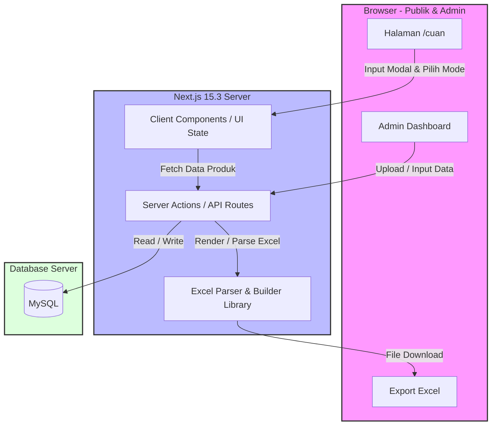
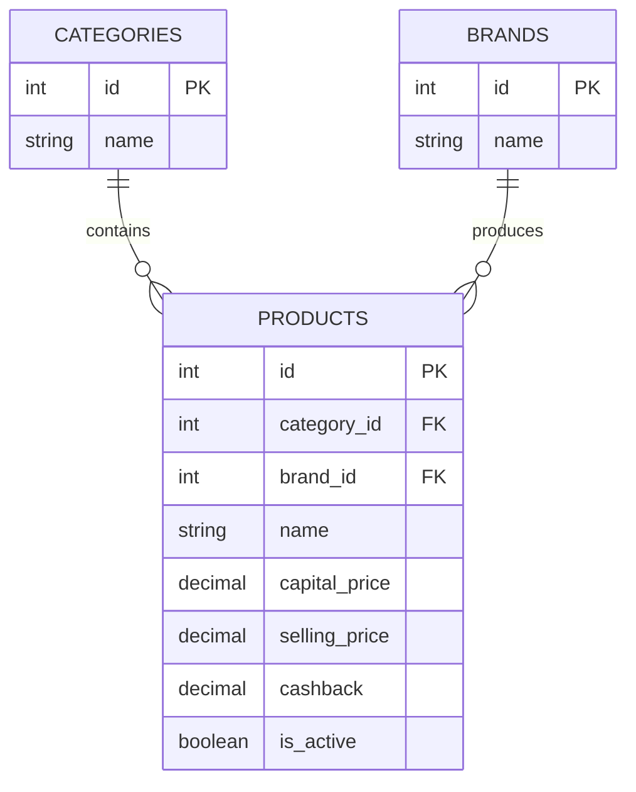

# PRD — Project Requirements Document

## 1. Overview
**Kalkulator Cuan** adalah sebuah fitur *sub-halaman* (terletak di `abkciraya.cloud/cuan`) yang dirancang untuk membantu para agen atau pengguna aplikasi **DigiposAja** dalam mensimulasikan dan menghitung potensi keuntungan (margin) dari transaksi mereka. 

Seringkali, agen kesulitan mengelola modal yang terbatas untuk mendapatkan keuntungan maksimal dari berbagai produk seperti Pulsa, Paket Internet, Inject Voucher, PPOB, dll. Aplikasi ini menyelesaikan masalah tersebut dengan mengizinkan pengguna memasukkan nominal modal awal, lalu secara cerdas menampilkan rekomendasi produk dengan keuntungan tertinggi atau memberikan kebebasan kepada pengguna untuk memilih produk layaknya keranjang belanja, di mana pilihan produk akan otomatis terkunci (tidak bisa dipilih) jika harganya melebihi sisa modal.

## 2. Requirements
- **Integrasi Web Utama:** Sistem harus diintegrasikan langsung sebagai rute baru (sub-halaman `/cuan`) pada website ABK Ciraya yang sudah ada tanpa merusak arsitektur yang berjalan.
- **Konsistensi UI/UX:** Tampilan antarmuka (UI) harus sama persis (*seamless*) dengan desain utama website ABK Ciraya saat ini.
- **Akses Pengguna Publik:** Fitur kalkulator cuan dapat diakses dan digunakan oleh publik (tanpa perlu proses registrasi/login).
- **Akses & Hak Akses Admin:** Hanya level *Super Admin* yang memiliki akses untuk mengelola data master produk.
- **Sumber Data & Manajemen:** Admin harus bisa menambahkan produk baru secara manual satu per satu atau melakukan proses *bulk upload* menggunakan file Excel.
- **Fungsi Export:** Publik/pengguna harus bisa mengunduh (export) hasil rancangan transaksi/simulasi mereka ke dalam format file Excel.
- **Database:** Sistem penyimpanan data wajib menggunakan MySQL.

## 3. Core Features
- **Input Modal & Simulasi Real-time:** Kolom bagi pengguna untuk memasukkan modal awal. Tampilan akan terus memperbarui sisa modal dan total keuntungan secara *real-time* seiring pemilihan produk.
- **Mode 1: Rekomendasi Cuan Maksimal:** Algoritma otomatis yang mengkalkulasi dan menyusun keranjang transaksi berisi kombinasi produk untuk menghasilkan keuntungan (margin + cashback) maksimal berdasarkan modal yang dimasukkan.
- **Mode 2: Keranjang Pilihan Mandiri (Interactive Cart):** Pengguna memilih sendiri produk dan jumlahnya (*quantity*). Sistem memiliki validasi cerdas: jika sisa modal pengguna adalah Rp 70.000, maka semua tombol "Pilih" pada produk seharga Rp 70.001 ke atas akan otomatis dinonaktifkan (*disabled*).
- **Manajemen Katalog Hierarkis (Admin):** Modul pada halaman admin untuk mengelola:
  - *Kategori:* Pulsa, Paket Internet, Paket Digital, Paket Roaming, Inject Voucher Fisik, Aktifasi Perdana.
  - *Merek (Brand):* Simpati, byU, PPOB, e-wallet.
- **Master Data Produk (Admin):** Formulir dan pengunggah dokumen (*Excel Upload*) untuk mencatat Produk, Harga Modal, Harga Jual, dan Cashback (Opsional). Algoritma keuntungan otomatis diset dari (Harga Jual - Harga Modal) + Cashback.
- **Export Hasil (User):** Tombol aksi di akhir simulasi bagi pengguna untuk menyimpan ringkasan transaksi ke file berformat `.xlsx`.

## 4. User Flow

**Alur Pengguna Publik (Kalkulator):**
1. Pengguna membuka halaman `abkciraya.cloud/cuan`.
2. Pengguna memasukkan nominal **Modal Awal** (contoh: Rp 500.000).
3. Pengguna memilih salah satu opsi:
   - **Tombol "Hitungkan Cuan Maksimal":** Sistem memproses dan langsung menampilkan daftar produk yang harus dijual.
   - **Tombol "Pilih Sendiri":** Sistem menampilkan daftar produk. Pengguna menekan tombol tambah (+) pada produk yang diinginkan.
4. Jika menggunakan "Pilih Sendiri", sisa modal akan berkurang. Produk yang harganya melebihi angka sisa modal akan berubah warna/terkunci (tidak bisa diklik).
5. Setelah selesai, pengguna melihat Ringkasan (Total Modal Terpakai, Sisa Modal, Total Keuntungan).
6. Pengguna menekan tombol **Export Excel** untuk mengunduh rencana transaksi tersebut.

**Alur Super Admin (Manajemen Produk):**
1. Admin login ke dashboard portal admin ABK Ciraya.
2. Membuka menu navigasi "Kalkulator Cuan -> Master Produk".
3. Admin memilih untuk **Tambah Manual** (mengisi form Kategori, Merek, Nama, Harga, Cashback) atau **Upload Excel** (mengunggah file sesuai *template*).
4. Klik simpan. Data langsung tersedia dan ter-update di halaman publik.

## 5. Architecture

Sistem ini mengikuti arsitektur website utama yang berkonsep *Fullstack Server-rendered* menggunakan Next.js. Proses logika (perhitungan cuan, validasi keranjang belanja) dilakukan seoptimal mungkin di sisi *Client* agar terasa cepat dan interaktif (React state), sementara validasi data awal dan admin *upload* diproses di server.

## 6. Database Schema

Untuk mendukung fungsionalitas Kalkulator Cuan dan operasional DigiposAja, berikut adalah struktur tabel relasional yang dibutuhkan dalam MySQL:

### Daftar Tabel Terkait:
1. **`categories`**: Menyimpan jenis produk (Pulsa, Paket Internet, dll).
   - `id` (INT, PK) - ID Unik.
   - `name` (VARCHAR) - Nama kategori.
2. **`brands`**: Menyimpan merek produk (Simpati, byU, dll).
   - `id` (INT, PK) - ID Unik.
   - `name` (VARCHAR) - Nama merek.
3. **`products`**: Menyimpan data seluruh produk DigiposAja.
   - `id` (INT, PK) - ID Unik.
   - `category_id` (INT, FK) - Referensi kategori.
   - `brand_id` (INT, FK) - Referensi merek.
   - `name` (VARCHAR) - Nama paket / produk.
   - `capital_price` (DECIMAL) - Harga Modal (potongan dari saldo agen).
   - `selling_price` (DECIMAL) - Harga Jual standar ke pelanggan.
   - `cashback` (DECIMAL) - *Opsional*, cashback/komisi tambahan yang didapat agen.
   - `is_active` (BOOLEAN) - Status visibilitas produk.

*(Catatan: Tabel `users`/`admins` tidak dirinci karena diasumsikan akan menggunakan atau menyambung dengan tabel autentikasi sistem ABK Ciraya yang sudah ada).*

## 7. Tech Stack

Mengingat integrasi dilakukan pada website *ABK Ciraya* yang sudah berjalan, *tech stack* ini diselaraskan dengan teknologi *existing*:

- **Frontend & Server Framework:** Next.js 15.3 (App Router)
- **UI Library & Styling:** React 19, Tailwind CSS (Design System menggunakan *styling* yang "Sama Persis" dengan web utama yang ada).
- **State Management (Client-side):** React Hooks (`useState`, `useMemo` untuk proses penyaringan harga batas secara *real-time*).
- **Database Relasional:** MySQL
- **ORM / Query Builder:** Prisma ORM atau Drizzle ORM (tergantung yang saat ini digunakan di server web, sangat baik untuk Typescript dan Next.js Server Actions).
- **Library Tambahan:**
  - `xlsx` atau `exceljs`: Digunakan di Frontend (pengguna unduh Excel) dan Backend (Admin upload/parsing data produk via Excel).