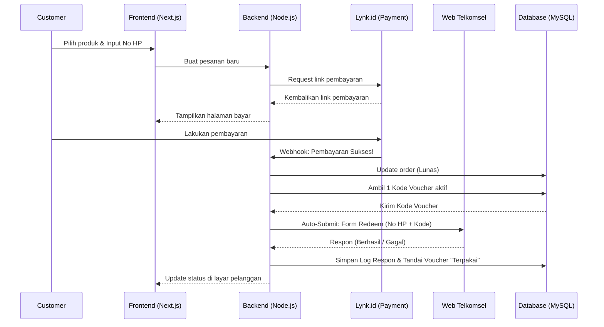
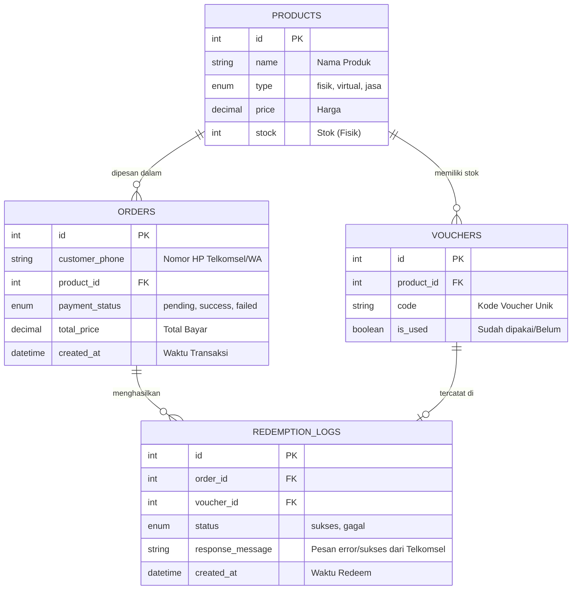

# PRD — Project Requirements Document

## 1. Overview
Aplikasi ini merupakan pengembangan dari landing page website `abkciraya.cloud` dengan menambahkan fitur **Halaman Belanja (Shopping Page)**. Tujuan utama proyek ini adalah memungkinkan pelanggan untuk membeli tiga jenis produk: fisik (kartu perdana, modem), virtual (paket internet), dan jasa (pemasangan Indihome). 

Nilai tambah utama dari sistem ini adalah otomatisasi pada produk virtual. Saat pelanggan membeli paket internet dan pembayaran berhasil diverifikasi melalui *payment gateway* (Lynk.id), sistem akan otomatis mencarikan kode voucher dari database dan menebuskannya (*redeem*) ke halaman resmi Telkomsel atas nama nomor pelanggan tersebut. Sistem juga akan menyediakan dashboard admin untuk mempermudah pengelolaan stok, upload voucher massal via CSV, dan memonitor laporan penjualan.

## 2. Requirements
- **Manajemen Berbagai Jenis Produk:** Sistem harus bisa membedakan alur belanja untuk produk fisik (butuh pengiriman manual), produk jasa (butuh penjadwalan/koordinasi), dan produk virtual (otomatisasi).
- **Otomatisasi Redeem Telkomsel:** Sistem backend harus mampu melakukan simulasi pengisian form (Nomor HP pembeli & Kode Voucher dari database) ke URL Telkomsel secara otomatis dan menyimpan log hasilnya (sukses/gagal).
- **Integrasi Pembayaran:** Menggunakan payment gateway dari Lynk.id untuk menerima pembayaran secara otomatis dan aman.
- **Kemudahan Operasional Admin:** Admin harus bisa mengunggah ribuan kode voucher sekaligus menggunakan file CSV, serta mengatur diskon promo.
- **Komunikasi Pelanggan:** Notifikasi pengiriman produk fisik dan layanan pelanggan (CS) dilakukan secara manual (oleh admin) melalui WhatsApp.

## 3. Core Features
- **Katalog Produk & Keranjang Belanja:** Menyajikan produk berdasarkan kategori (Fisik, Virtual, Jasa) dengan tampilan antarmuka yang ramah pengguna.
- **Checkout & Kolom Input Nomor HP:** Khusus untuk produk virtual, pelanggan diwajibkan memasukkan nomor Telkomsel mereka sebelum membayar.
- **Automated Voucher Engine:** Fitur robot di latar belakang (*bot*) yang bekerja setelah pembayaran lunas untuk mengklaim voucher di situs web Telkomsel.
- **Sistem Pencatatan (Logging System):** Menyimpan setiap respon dari situs Telkomsel saat proses klaim voucher terjadi, sehingga admin bisa melakukan investigasi jika ada klaim yang gagal.
- **Dashboard Admin:** 
  - Manajemen Stok & Produk (Fisik, Jasa, Virtual).
  - Upload CSV untuk stok kode voucher internet.
  - Pengaturan Diskon.
  - Laporan Penjualan (Sales Report).

## 4. User Flow
**Alur Pembelian Produk Virtual (Paket Internet):**
1. **Pelanggan** membuka website `abkciraya.cloud` dan masuk ke halaman belanja.
2. Memilih produk **Voucher Internet Virtual** dan memasukkan **Nomor Telkomsel** mereka.
3. Melanjutkan ke pembayaran menggunakan **Lynk.id**.
4. Setelah pelanggan sukses membayar, sistem **menandai pesanan Lunas**.
5. Sistem mengambil 1 **Kode Voucher** yang belum terpakai dari database.
6. Sistem secara otomatis men-submit Nomor Pelanggan dan Kode Voucher ke web Telkomsel.
7. Sistem mencatat hasil (Sukses/Gagal) dan menampilkannya di halaman status / riwayat pesanan pelanggan. Admin menghubungi via WhatsApp jika terjadi masalah gagal *redeem* di pihak Telkomsel.

## 5. Architecture
Sistem terdiri dari Frontend (untuk pelanggan), Backend (pusat logika & *redeem bot*), Database MySQL, dan Dashboard Admin. Backend bertugas sebagai jembatan yang berkomunikasi dengan Lynk.id (cek pembayaran) dan website Telkomsel (proses klaim).

## 6. Database Schema
Berikut adalah struktur data utama yang dibutuhkan untuk menjalankan aplikasi ini:

- **Products**: Menyimpan detail barang atau jasa yang dijual.
- **Orders**: Menyimpan data transaksi pelanggan.
- **Vouchers**: Menyimpan stok kode voucher (diunggah dari CSV).
- **Redemption_Logs**: Menyimpan rekam jejak (*history*) dari proses bot ke website Telkomsel untuk keperluan audit.

## 7. Tech Stack
Berikut adalah rekomendasi teknologi berbasis *input user* dengan standar industri terkini untuk membangun sistem e-commerce mini ini:

- **Frontend:** Next.js (Memberikan performa SEO yang baik dan loading halaman belanja yang sangat cepat).
- **Styling UI:** Tailwind CSS & shadcn/ui (Untuk tampilan desain yang bersih, rapi, dan modern).
- **Backend / API:** Node.js (Menggunakan *Express.js*). Untuk otomatisasi klaim form Telkomsel, backend dapat menggunakan *Puppeteer* (jika butuh simulasi browser asli) atau *Axios + Cheerio* (jika Telkomsel mengizinkan *direct request* tanpa *captcha block*).
- **Database:** MySQL
- **Manajemen Database (ORM):** Prisma ORM atau Sequelize (agar backend Node.js mudah berinteraksi dan mengelola tabel MySQL).
- **Payment Gateway:** SDK/API Lynk.id (untuk e-wallet & transfer bank).
- **Deployment:** VPS Linux (contoh: Ubuntu). Menggunakan PM2 untuk menjaga Backend Node.js tetap hidup, Nginx sebagai Web Server, dan Docker (jika ingin instalasi yang rapi).